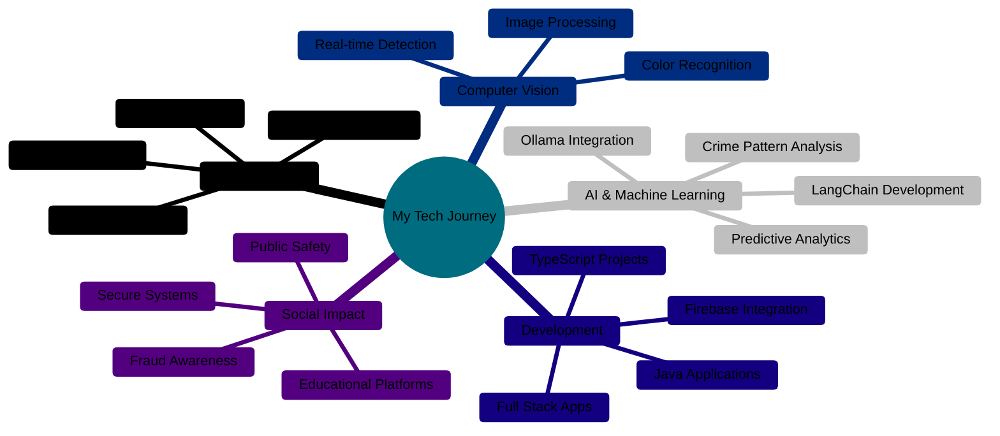

<div align="center">

# 🚀 Welcome to Hyperterror's Tech Domain 💻


</div>

---

## 🎯 About Me

```python
class Hyperterror:
    def __init__(self):
        self.username = "Hyperterror"
        self.role = "Developer & Tech Enthusiast"
        self.interests = [
            "Cybersecurity",
            "Machine Learning",
            "Computer Vision",
            "AI Engineering",
            "Security Research"
        ]
        self.current_projects = [
            "Crime Analysis & Prediction",
            "Call Fraud Awareness Platform",
            "Real-time Color Detection"
            "Offline Agentic Chatbot"
        ]
        self.learning = ["Cybersecurity", "AI/ML", "Ollama", "AI Security","Full Stack Development","Cloud Technologies"]

    def say_hi(self):
        print("👋 Thanks for visiting! Let's code something amazing together!")
```

---

## 🛠️ Tech Stack & Tools

<div align="center">


### 💻 Programming Languages


### 🤖 AI/ML & Data Science


### 🔒 Cybersecurity & Security Tools


### 🚀 Frameworks & Libraries


### 🗄️ Databases & Cloud


</div>

---

## 🌟 Featured Projects

<div align="center">

| Project | Description | Tech Stack |
|---------|-------------|------------|
| 🚨 [Crime Analysis & Prediction](https://github.com/Hyperterror/Crime_Analysis_Prediction_System) | Advanced system for analyzing and predicting crime patterns | Python, ML, Data Science |
| ☎️ [Call Fraud Awareness](https://github.com/Hyperterror/Call-fraud-Awareness) | Educational platform to spread awareness about phone scams | Python, Web Development |
| 🎨 [Neon Color Detector](https://github.com/Hyperterror/Neon-Color-Detector) | Real-time neon color detection using computer vision | Python, OpenCV |
| 💼 [Manipal IIIC](https://github.com/Hyperterror/Manipal_IIIC_2) | Offline Agentic Chatbot | TypeScript | Python , Ollama| Firebase | Docker |

</div>

---

## 📊 GitHub Analytics

<div align="center">
  
  
</div>

<div align="center">
  
</div>

<div align="center">
  
</div>

---

## 🏆 GitHub Trophies

<div align="center">
  
</div>

---

## 🔥 What I'm Working On



---

## 🎓 Current Focus

<table align="center">
<tr>
<td width="50%">

#### 🔬 Building
- 🔐 Cybersecurity Solutions & Tools
- 🤖 LangChain + Ollama AI Applications
- 🛡️ Security & Fraud Prevention Systems
- 📊 Data-Driven Analytics Platforms
- 🎯 Computer Vision Applications
- 🔥 Firebase-Powered Applications

</td>
<td width="50%">

#### 🎯 Learning
- 🔒 Advanced Cybersecurity Techniques
- 🧠 AI Security & Adversarial ML
- ☁️ Cloud Security (AWS/Azure)
- 🕵️ Ethical Hacking & Pentesting
- 🚀 DevSecOps Practices
- 🌐 Blockchain Security

</td>
</tr>
</table>

---

## 💡 Random Dev Quote

<div align="center">
  
</div>

---

## 🌐 Connect With Me
<div align="center">
<a href="https://github.com/Hyperterror" target="_blank">

</a>
<a href="https://linkedin.com/in/ishit-agarwal-062417320" target="_blank">

</a>
<a href="mailto:agarwalishit2006@gmail.com" target="_blank">

</a>
</div>

---

## 📈 Contribution Graph

<div align="center">
  
</div>

---

<div align="center">
  
  
  ### 💖 Thanks for visiting! Let's build something extraordinary together! 🚀
  
  
  
  
</div>
